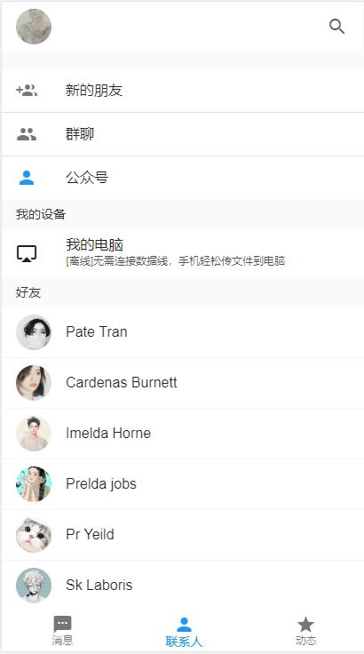
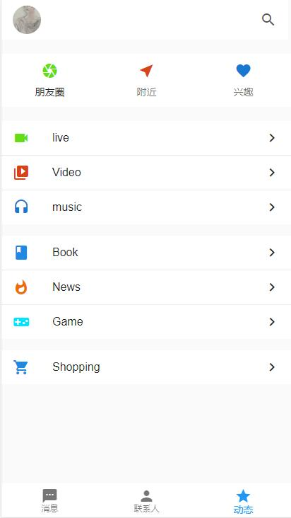
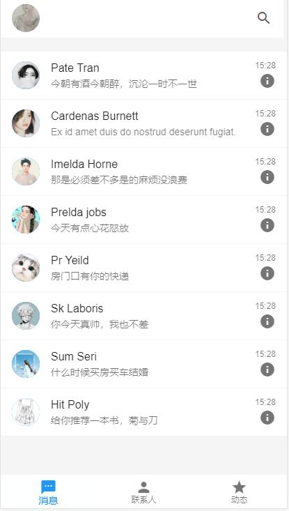
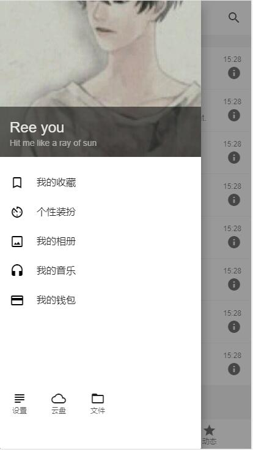
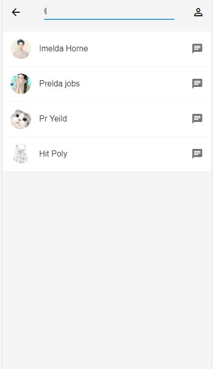
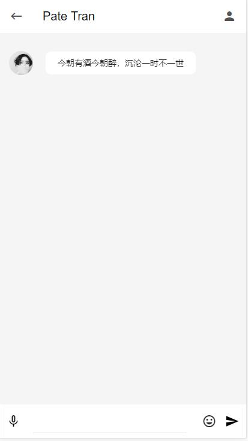
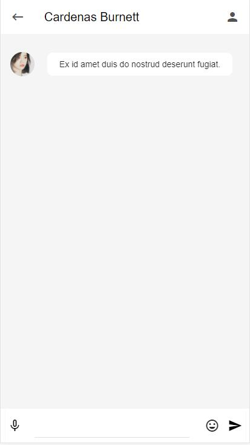

# vue-wechat

> A Vue.js project


## 简介
* 基础组件：各个组件需要实现的功能的编写、抽取公共组件
* 数据通信：axios + mockjs + json数据
* 懒加载： vue-lazyload实现图片懒加载，webpack路由懒加载
* 库/插件：muse-ui/better-scroll(滚动插件)---
* 状态管理：Vuex

## 需求分析及组件编写
* 开始分析项目需求，确立了需要实现的功能、模块之间的依赖关系和各组件页面样式及联系。
* 编写需要展示的josn数据，数据获取通过axios和mockjs实现
* 实现了联系人(home)、信息栏(message)、动态中心(user)页面样式的编写及数据联调
* 通过vue-router实现路由交互


## 组件完善
* 在实现侧边栏、个人主页和搜索页面样式后
* 初步通过vuex中state和mutations实现sideBar与home间数据传递，从而实现点击侧边栏出现功能
* 在router方面目前开始使用 this.$router.push('/path') 初步实现
* 想法:在路由跳转后获取页面的设定 boolean 值，通过 v-if 来实现topBar和footBar组件的消失


## Vuex全局数据
* 在实现了对话页面及完善搜索页面后，
* 通过actions异步ajax进行获取json数据，分发到mutations，保存到了全局state，遇到了一个小坑就是在想怎么在实例挂载之前(beforeCreate)获取数据，不然此时得到的数据为空对象
* 后来在全局中(main.js)中调用beforeCreate进行数据获取
* 初步实现了全页面的交互和部分数据通信

## 数据联调
* 在组件数据通信中[Vuex]作用很大，在路由跳转中由于topBar和footBar在全局应用，所以在其他页面可能不需要用到，在全局定义变量为true，通过[v-if]判断跳转到子页面时不展示改变其值为false，
* 在获取每个id的信息值时，用到了getters筛选点击传入的id与json数据中_id相匹配，从而返回个人信息
  > 在这之中，实现的想法很容易，但获取的时候还是遇了小坑，一定要注意全局变量要先引入，[vue-deevtools]帮了很大忙。

**miniQQ部分截图演示**

#### 主页

#### detail

#### 信息

#### 个人信息

#### 侧边栏

#### 搜索

#### 聊天



## Build Setup

``` bash
# install dependencies
npm install

# serve with hot reload at localhost:8080
npm run dev

# build for production with minification
npm run build

# build for production and view the bundle analyzer report
npm run build --report
```


